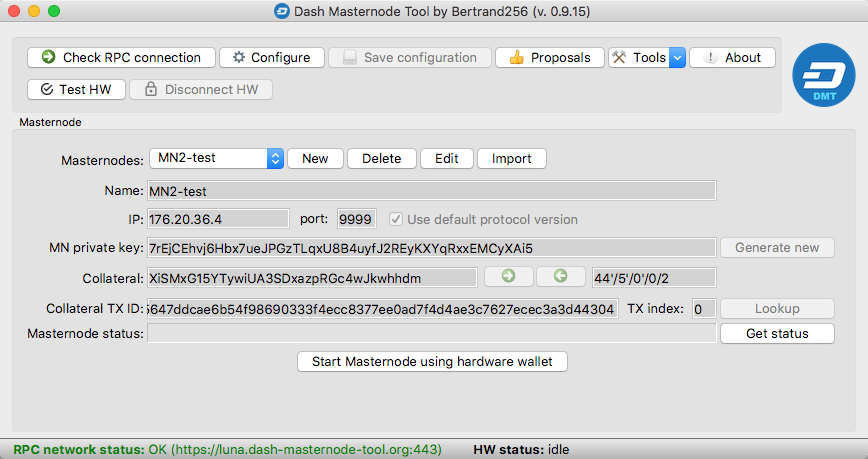
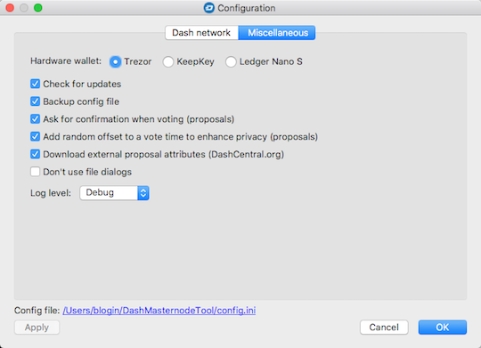
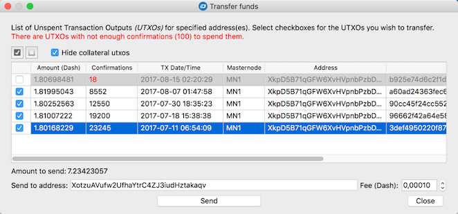
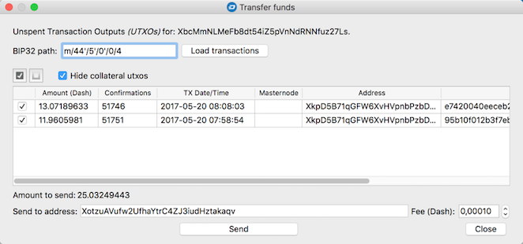
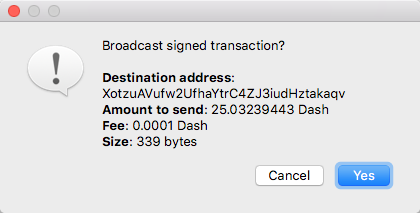
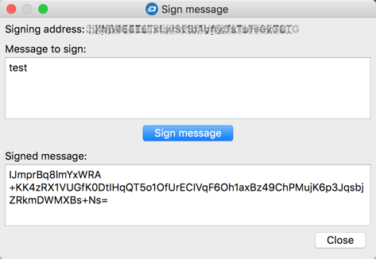
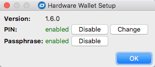

# Terracoin Masternode Tool (TMT)

## Contents

 * [Masternodes](#masternodes)
 * [Terracoin Masternode Tool](#terracoin-masternode-tool)
   * [Feature list](#feature-list)
   * [Supported hardware wallets](#supported-hardware-wallets)
 * [Configuration](#configuration)
   * [Setting up the hardware wallet type](#setting-up-the-hardware-wallet-type)
   * [Connection setup](#connection-setup)
     * [Connection to a local node](doc/config-connection-direct.md)
     * [Connection to a remote node through an SSH tunnel](doc/config-connection-ssh.md)
     * [Connection to "public" JSON-RPC nodes](doc/config-connection-proxy.md)
   * [Masternode setup](#masternode-setup)
     * [Scenario A: moving masternode management from Terracoin Core](doc/config-masternodes-a.md)
     * [Scenario B: configuring a new masternode](doc/config-masternodes-b.md)
   * [Command line parameters](#command-line-parameters)
 * [Features](#features)
   * [Starting a masternode](#starting-a-masternode)
   * [Transferring masternode earnings](#transferring-masternode-earnings)
   * [Signing messages with a hardware wallet](#signing-messages-with-a-hardware-wallet)
   * [Changing a hardware wallet PIN/passphrase](#changing-a-hardware-wallet-pinpassphrase)
   * [Browsing and voting on proposals](doc/proposals.md)
   * [Hardware wallet initialization/recovery](doc/hw-initialization-recovery.md)
 * Building the TMT executables
    * [macOS](doc/build-tmt-mac.md)
    * [Windows](doc/build-tmt-windows.md)
    * Linux
       * [Ubuntu](doc/build-tmt-linux-ubuntu.md)
       * [Fedora](doc/build-tmt-linux-fedora.md)
 * [Downloads](https://github.com/TheSin-/terracoin-masternode-tool/releases/latest)
 * [Changelog](changelog.md)

## Masternodes

Terracoin masternodes are full nodes which are incentivized by receiving a share of the block reward as payment in return for the tasks they perform for the network, of which the most important include participation in *InstantSend* and *PrivateSend* transactions. In order to run a masternode, apart from setting up a server which runs the software, you must dedicate 5000 TRC as *collateral*, which is *"tied up"* in your node as long as you want it to be considered a masternode by the network. It is worth mentioning that the private key controlling the funds can (and for security reasons, should) be kept separately from the masternode server itself.

A server with the Terracoin daemon software installed will operate as a Terracoin full node, but before the rest of the network accepts it as a legitimate masternode, one more thing must happen: the person controlling the node must prove that they are also in control of the private key to the node's 5000 TRC *collateral*. This is achieved by sending a special message to the network (`start masternode` message), signed by this private key.

This action can be carried out using the *Terracoin Core* reference software client. As can be expected, this requires sending 5000 TRC to an address controlled by the *Terracoin Core* wallet. After the recent increase in the value of Terracoin and a burst in the amount of malware distributed over the Internet, you do not have to be paranoid to conclude that keeping large amounts of funds in a software wallet is not the most secure option. For these reasons, it is highly recommended to use a **hardware wallet** for this purpose.

## Terracoin Masternode Tool

The main purpose of the application is to give masternode operators (MNOs) the ability to send the `start masternode` command through an easy to use a graphical user interface if the masternode collateral is controlled by a hardware wallet such as Trezor, KeepKey or Ledger.

### Feature list

* Sending the `start masternode` command if the collateral is controlled by a hardware wallet.
* Transferring masternode earnings safely, without touching the 5000 TRC funding transaction.
* Signing messages with a hardware wallet.
* Voting on proposals.

### Supported hardware wallets

- [x] Trezor
- [x] KeepKey
- [x] Ledger Nano S

Most of the application features are accessible from the main program window:  

## Configuration

### Setting up the hardware wallet type
 * Click the `Configure` button.
 * Select the `Miscellaneous` tab in the configuration dialog that appears.
 * Depending on the type of your hardware wallet, select the `Trezor`, `Keepkey` or `Ledger Nano S` option.  
     

### Connection setup

Most of the application features involve exchanging data between the application itself and the Terracoin network. To do this, *TMT* needs to connect to one of the full nodes on the network, specifically one which can handle JSON-RPC requests. This node plays the role of a gateway for *TMT* to the Terracoin network. It does not matter which full node node provides the service, because all nodes reach consensus by synchronizing information between each other on the Terracoin network.

Depending on your preferences (and skills) you can choose one of three possible connection types:
 * [Direct connection to a local node](doc/config-connection-direct.md), for example to *Terracoin Core* running on your normal computer.
 * [Connection to a remote node through an SSH tunnel](doc/config-connection-ssh.md), if you want to work with a remote Terracoin daemon (like your masternode) through an SSH tunnel.
 * [Connection to "public" JSON-RPC nodes](doc/config-connection-proxy.md), if you want to use nodes provided by other users.

### Masternode setup

Here we make the following assumptions:
  * You already have a server running the Terracoin daemon software (*terracoind*) that you want to use as a masternode. If you don't, you will need to install and configure one first by following the guide on the [Terracoin Wiki](https://wiki.terracoin.io/index.php/Masternode_Setup).
  * We occasionally refer to the *terracoind* configuration file, so it is assumed that *terracoind* is running under a Linux operating system (OS), which is the most popular and recommended OS for this purpose.
  * Your server has a public IP address that will be visible on the Internet.
  * You have set up a TCP port on which your *terracoind* listens for incoming connections (usually 13333).

Further configuration steps depend on whether you already have a masternode controlled by *Terracoin Core* which you want to migrate to a hardware wallet managed by *TMT*, or if you are setting up a new masternode.

[Scenario A - moving masternode management from Terracoin Core](doc/config-masternodes-a.md)  
[Scenario B - configuration of a new masternode](doc/config-masternodes-b.md)

### Command line parameters

The application currently supports the following command-line parameters:
* `--data-dir`: a path to a directory in which the application will create all the needed files, such as: configuration file, cache and log files; it can be useful for users who want to avoid leaving any of the application files on the computer - which by default are created in the user's home directory - and insted to keep them on an external drive
* `--config`: a non-standard path to a configuration file. Example:
  `TerracoinMasternodeTool.exe --config=C:\tmt-configs\config1.ini`

## Features

### Starting a masternode

Once you set up the Terracoin daemon and perform the required *TMT* configuration, you need to broadcast the `start masternode` message to the Terracoin network, so the other Terracoin nodes recognize your daemon as a masternode and add it to the payment queue.

To do this, click the `Start Masternode using Hardware wallet` button.

### Sequence of actions

This section describes the steps taken by the application while starting the masternode, and possible errors that may occur during the process.

The steps are as follows:

1. Verification that all the required fields are filled with correct values. These fields are: `IP`, `port`, `MN private key`, `Collateral`, `Collateral TX ID` and `TX index`.
  An example message in case of errors:  
  

2. Opening a connection to the Terracoin network and verifying if the Terracoin daemon to which it is connected is not still waiting for synchronization to complete.
  Message in case of failure:  
  

3. Verification that the masternode status is not already `ENABLED` or `PRE_ENABLED`. If it is, the following warning appears:  
    
  If your masternode is running and you decide to send a `start masternode` message anyway, your masternode's payment queue position will be reset.

4. Opening a connection to the hardware wallet. Message in case of failure:  
  

5. If the `BIP32 path` value is empty, *TMT* uses the *collateral address* to read the BIP32 path from the hardware wallet.

6. Retrieving the Terracoin address from the hardware wallet for the `BIP32 path` specified in the configuration. If it differs from the collateral address provided in the configuration, the following warning appears:  
    
  The most common reason for this error is mistyping the hardware wallet passphrase. Remember that different passphrases result in different Terracoin addresses for the same BIP32 path.

7. Verification that the specified transaction ID exists, points to your collateral address, is unspent and is equal to exactly 5000 TRC. Messages in case of failure:  
    
    
  If you decide to continue anyway, you probably won't be able to successfully start your masternode.

8. Verification at the Terracoin network level that the specified transaction ID is valid. Message in case of failure:  
  

9. After completing all pre-verification, the application will ask you whether you want to continue:  
    
  This is the last chance to stop the process.

10. Sending the `start masternode` message. Success returns the following message:  
    
  In case of failure, the message text may vary, depending on the nature of the problem. Example:  
  

### Transferring masternode earnings

TMT version 0.9.4 and above allows you to transfer your masternode earnings. Unlike other Terracoin wallets, TMT gives you a 100% control over which *unspent transaction outputs* (utxo) you want to transfer. This has the same effect as the `Coin control` functionality implemented in the *Terracoin Core* wallet.

The `Transfer funds` window shows all *UTXOs* of the currently selected Masternode (mode 1), all Masternodes in current configuration (mode 2) or any address controlled by a hardware wallet (mode 3). All *UTXOs* not used as collateral are initially selected. All collateral *UTXOs* (5000 TRC) are initially hidden to avoid unintentionally spending collateral funds and thus breaking MN. You can show these hidden entries by unchecking the `Hide collateral utxos` option.

To show the `Transfer funds` window, click the `Tools` button. Then, from the popup menu choose:
 * `Transfer funds from current Masternode's address` (mode 1)
 * `Transfer funds from all Masternodes addresses` (mode 2)
 * `Transfer funds from any HW address` (mode 3)

Sending masternode payouts:  

Transferring funds from any address controlled by a hardware wallet:  

Select all *UTXOs* you wish to include in your transaction, verify the transaction fee and click the `Send` button. After signing the transaction with your hardware wallet, the application will ask you for confirmation to broadcast the signed transaction to the Terracoin network.  

After clicking `Yes`, the application broadcasts the transaction and then shows a message box with a transaction ID as a hyperlink directing to a Terracoin block explorer:  

### Signing messages with a hardware wallet

To sign a message with your hardware wallet, click the `Tools` button and then select the `Sign message with HW for current Masternode's address` menu item. The `Sign message` window appears:  

### Changing hardware wallet PIN/passphrase

Click the `Tools` button and select the `Hardware wallet PIN/Passphrase configuration` item. The following window will appear to guide you through the steps of changing the PIN/passphrase:  

### Downloads

This application is written in Python 3, but requires several additional libraries to run. These libraries in turn require the installation of a C++ compiler. All in all, compiling TMT from source is not trivial for non-technical people, especially the steps carried out under Linux (though this will be documented soon).

For this reason, in addition to providing the source code on GitHub, binary versions for all three major operating systems - macOS, Windows (32 and 64-bit) and Linux - are available for download directly. The binaries are compiled and tested under the following OS distributions:
* Windows 7 64-bit
* macOS 10.13.2 High Sierra
* Linux Debian Jessie

Binary versions of the latest release can be downloaded from: https://github.com/TheSin-/terracoin-masternode-tool/releases/latest.

#### Verification of the binary files
Beginning with version 0.9.15, each binary file forming part of a release has a corresponding signature file that you can use to verify the authenticity of the downloaded binary file (to ensure it has not been corrupted or replaced with a counterfeit) and confirm that it has been signed by the application author (Keybase user: TheSin-).

